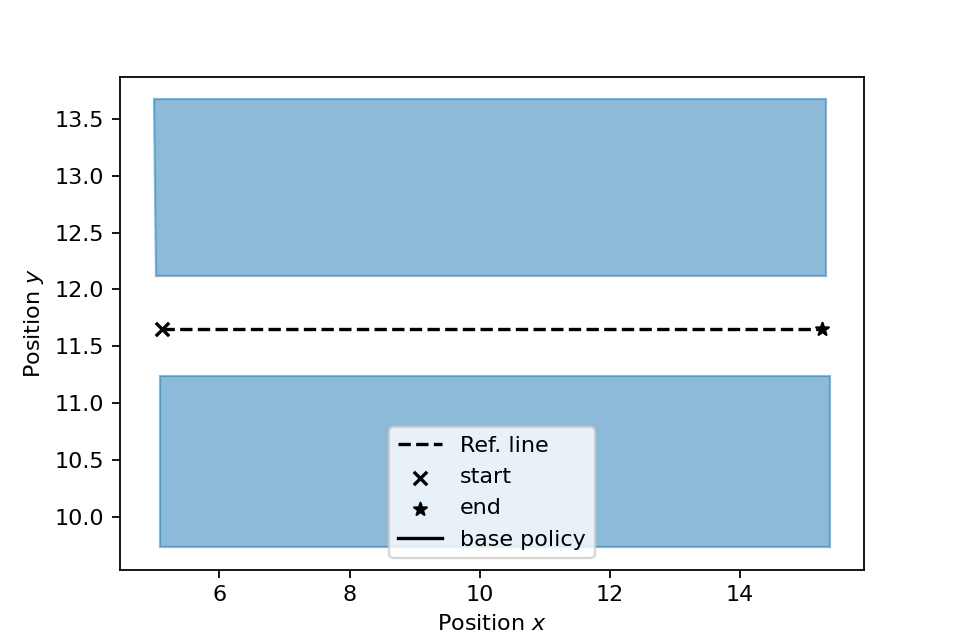
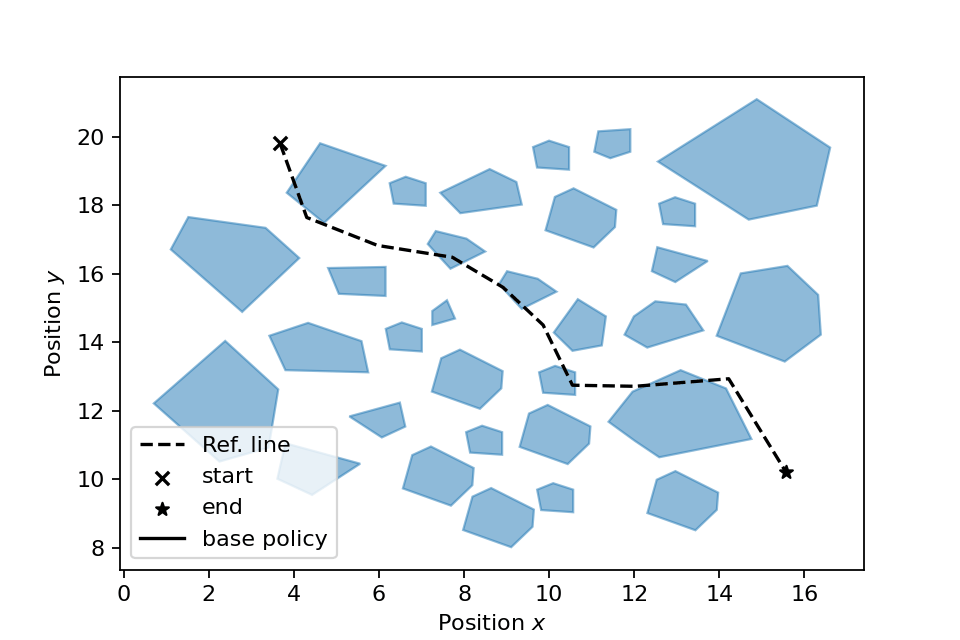
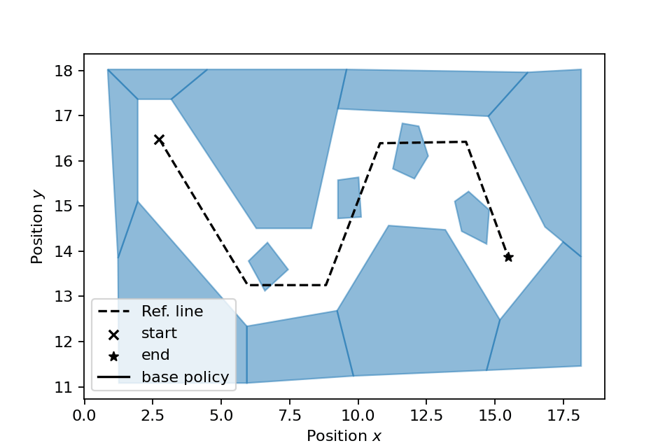

<h1 align="center">
Probabilistic Safety under Arbitrary Disturbance Distributions using Piecewise-Affine Control Barrier Functions
</h1>

<p align="center">



</p>

<a href="https://mathijssch.github.io/ecc26-supplementary/">
  <b>Project page</b>
</a> |
<a href="">
  <b>Paper</b>
</a>

---


This repository contains the safety filter implementations
and experiments corresponding to the results in Section V of
the paper
*"Probabilistic Safety under Arbitrary Disturbance Distributions using Piecewise-Affine Control Barrier Functions"*
by Matisse Teuwen, Mathijs Schuurmans and Panagiotis Patrinos.

## Installation

Create a Python virtual environment (`venv` or `conda`).
Clone the repository, and from the root, run

```bash
pip install .
```

to install our library. Reproducing the experiments from the paper
can be done using the scripts in the `experiments` directory as explained below.

## Reproducing the experiments

All experiments from the paper can be reproduced using the scripts in `./experiments`.

### Corridor Experiments (Section V-A)


| Script | Section | Reproduces |
| ------- | ---------- | ------ |
| **`corridor_known_distribution.py`** | V-A-1 | Table I *(empirical exit probabilities)* |
| **`corridor_infeasibility.py`** | V-A-1 | Figure 2 *(σ–ε feasibility map)* |
| **`corridor_unknown_distribution.py`** | V-A-2 | Table II *(comparison with scenario and conformal methods)* |
| **`corridor_different_distributions.py`** | V-A-2 | Figure 3 *(comparison different noise distributions (Gaussian, Laplace, Student-t))* |


---

### Path-Planning Experiments (Section V-B)


| Script | Reproduces |
| ------- |  ------ |
| **`path_planning_plot.py`** | Figure 4 *(path planning example)* |
| **`path_planning_timings.py`** | Timing statistics of Algorithm 1 vs. MIQP |
| **`miqp_solution_quality_compare.py`** | Suboptimality of Algorithm 1 vs. MIQP |


## Citation

If you use this code, please cite:

```bibtex
@article{teuwen2025pwaCBF,
  title={Probabilistic Safety under Arbitrary Disturbance Distributions using Piecewise-Affine Control Barrier Functions},
  author={Teuwen, Matisse and Schuurmans, Mathijs and Patrinos, Panagiotis},
  journal={arXiv preprint arXiv:YYMM.NNNNN},
  year={2025}
}
```

